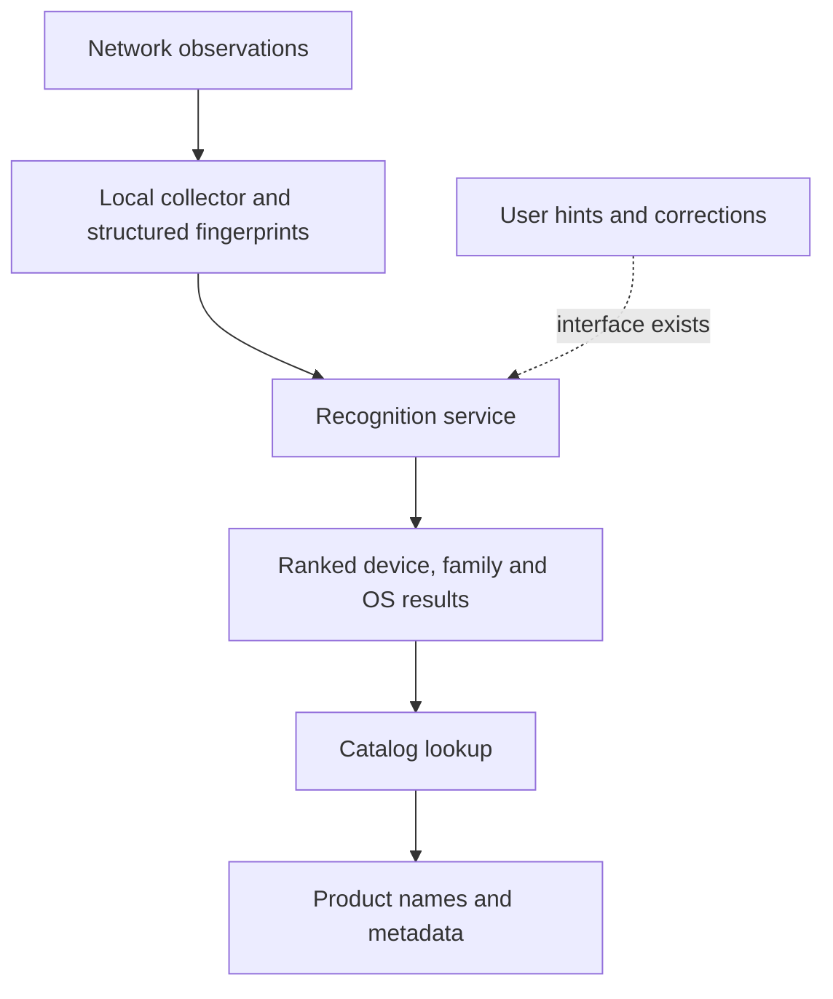

# Fing recognition: binary evidence and remaining unknowns

Analysis date: 2026-09-09. Scope: the previously downloaded macOS Fing 4.0.5 native binaries, the 3.10.1 Electron package, public Fing/Lansweeper technical documentation, and Lantern rc.7 source. This is a reconstruction of observable architecture, not a recovery of the complete proprietary classifier or catalog. Neither Fing application was executed during this inspection.

## What the catalog number means

Fing's homepage explicitly advertises **450K device models in its catalog**, verified on 2026-09-09. The earlier version of this report missed that primary source and incorrectly left the 450K claim unverified. [Fing homepage](https://www.fing.com/)

The separate Lansweeper OEM page advertises **365,000+ products**, **76,000+ brands**, **74,000+ operating systems**, and **5 million+ software entries**. The pages do not explain the difference between the product/model counts; their scope or update timing should not be assumed identical. For Fing's advertised model coverage, use its explicit **450K** figure. These are publisher catalog counts, not measurements of detection accuracy. Product models, broad device categories, OS records and fingerprint records are different units. [Lansweeper OEM recognition](https://www.lansweeper.com/partners/technology-partners/embed/device-recognition/)

The developer introduction separately describes over 100 device types in eight groups. A catalog can contain many product models within one type, such as smartphone. Neither count implies that every model can be distinguished from a silent host on an arbitrary LAN. [Developer introduction](https://developer.lansweeper.com/docs/device-recognition-api/get-started/welcome)

## Reconstructed architecture

This diagram synthesizes several observed paths; it is not a claim that every scan always follows one identical request sequence. Public collector documentation says the collector creates fingerprint JSON, while the integrating application submits it to a backend API or self-hosted recognition container. Collection and identification are separate responsibilities. The public OEM offering also includes offline database options. [Collector configuration](https://developer.lansweeper.com/docs/device-recognition-api/guides/configure-fingerprint), [deployment offerings](https://www.lansweeper.com/partners/technology-partners/embed/device-recognition/)

### Evidence from the desktop binaries

ARM64 symbol and instruction inspection establishes these direct calls. Addresses are virtual addresses in the specific binaries below, not portable offsets or API addresses.

| Function | Address | Observation |
| --- | --- | --- |
| `RemoteFingBox::identifyDevices` | agent `0x1001b52cc` | Calls `HttpsAsyncClient::post` at `0x1001b55d4`; decodes the identification response at `0x1001b5678` |
| `RemoteFingBox::disLookup` | agent `0x10019825c` | Calls the HTTPS POST client at `0x1001984b8` |
| `RecogCatalog::recogCatalogLookup` | agent `0x100187fb0` | Reads the user profile, then calls the remote catalog wrapper at `0x1001880ec` |
| `RemoteFingBox::recogCatalogLookup` | agent `0x1001887b4` | Calls `disLookup` at `0x1001887ec`, then decodes a catalog response |
| `DiscoveredInfo::processCompletedDiscovery` | agent `0x1001070b8` | Translates discovery observations at `0x1001076b0`, calls network enrichment at `0x100107714` |
| `DiscoveredInfo::enrichNetwork` | agent `0x1000f05bc` | Reads the profile and calls `AgentSnapshot::DiscoveryNetworkEnrichment` at `0x1000f0764` |
| `AgentSnapshot::DiscoveryNetworkEnrichment` | agent `0x1001ff984` | Constructs a network-discovery update request and calls `processMessage` at `0x1001ffbb4` |
| `BonjourResolver::handleAddNodeServiceInfo` | library `0xbc350` | Populates service information using `ServiceInfo::addInfo`, then associates it with a resolved device |
| `EthernetOuis::initSingleton` | library `0x10519c` | File-backed configurable OUI properties loader, established in the earlier inspection |

The identification and catalog wrappers are concrete remote-client evidence. They do not establish that all identification is cloud-only, that every wrapper executes in a particular edition, or that there are no local caches. `AgentSnapshot::processMessage` and the complete asynchronous dispatch graph were not exhaustively reconstructed.

### Embedded message schemas

A dependency-free protobuf wire parser recovered 27 embedded file descriptors containing 564 message definitions across the two native binaries. These are **schemas, not 564 fingerprints or product records**. Selected fields reveal how the system separates evidence from conclusions:

| Layer | Observed schema content | Meaning and limit |
| --- | --- | --- |
| Raw observations | `BonjourInfo`: services, service info, device model and OS; `DhcpInfo`: parameters, vendor, hostname, MUD; `Dhcp6Info`: option request, vendor, enterprise ID | Multiple fingerprint inputs can accompany one host; existence of a field does not prove its collector is active |
| Rich device responses | `SnmpInfo`: system OID, description, model, OS/version; `NetNode`: UPnP, HTTP, SSH, FTP, SMTP, SMB and other observations | More than a MAC-vendor lookup; a software banner still need not identify hardware |
| Enterprise inputs | Credential-scan fields for Mac, Linux, WMI, Intune, hypervisors and other systems | Shared data model accommodates authenticated inventory; this is not evidence of unauthenticated desktop access |
| Recognition result | `DeviceRecognition`: make/model/family/OS identifiers, family flag, model and OS names, versions, CPEs and rank | Supports family-level results and structured confidence/ranking, not just one display string |
| Product catalog | `RecogDevice`: model code, family link, default/latest OS references, lifecycle dates, documentation URLs and match score | Product enrichment can be attached after identification; metadata is not necessarily measured from the target |
| Catalog operations | Bulk lookup by IDs; separate totals for makes, devices, OSes, software and monitors | Catalog counts represent multiple entity classes |
| Corrections | User-hint and feedback request structures | Correction interfaces exist; the actual training algorithm and use of corrections remain unknown |

`DevRecogContext` includes a flag named `ml_disable_os`. That name suggests an OS machine-learning option, but does not reveal a model architecture, training set, features, weights, accuracy, or even whether it is enabled in the inspected path.

## How MAC addresses contribute beyond OUI

The dated offline-database manual describes a 30.5 GB SQLite snapshot with approximately 22.2 million MAC clusters, 59.5 million user-agent fingerprints, 1.3 million DHCP fingerprints and 590,000 hostname fingerprints. These are **May 2021 figures**, not current coverage.

Its MAC classifier partitions address space into variable-length prefixes, with finer clusters providing more specific matches and ranks resolving candidates. For example, a 41-bit prefix covers 128 addresses. This can encode model-associated allocation patterns within a manufacturer's address block, whereas a conventional OUI lookup identifies a registered organization. The document describes supervised segmentation, not a universal manufacturer-issued model code in every MAC.

The manual also documents salted SHA-512/Base64 fingerprint storage and lookup metadata. Obfuscated fingerprint keys are not readable device-name lists. These details explain why finding a small OUI file would not reproduce the full recognition engine. [Fing offline database manual, version 2.11, especially pp. 4 and 14–16](https://get.fing.com/fing-business/devrecog/documentation/Fing_Device_Recognition_Database.pdf)

The current MAC guide explicitly excludes locally administered addresses from MAC recognition. Its separate assertion that MAC addresses cannot change is too broad; Apple documents per-network private addresses and optional rotation on supported phones and Macs. A private address therefore cannot safely be treated as a factory allocation prefix. [MAC recognition guide](https://developer.lansweeper.com/docs/device-recognition-api/guides/mac), [Apple private Wi-Fi addresses](https://support.apple.com/en-us/102509)

## Macs, phones and exact models

**Advertised model identifiers.** DNS-SD provides service records and TXT key/value properties. These can expose substantially more information than an IP address. The public Bonjour guide describes this evidence channel, particularly for Apple and media devices. [Bonjour collection](https://developer.lansweeper.com/docs/device-recognition-api/guides/bonjour)

The native library initializes the `._device-info._tcp.local.` suffix in three translation units, including BonjourResolver at `0xc0930`. Its service-information handler stores observed properties. This supports a device-info collection path. The inspected function summaries do **not** prove the complete rule that Fing uses to turn every TXT model into a retail product name. The gratuitous-device-info handler also processes DNS records; its name alone must not be mistaken for proof of model classification.

Lantern already queries `_device-info._tcp`, `_airplay._tcp` and `_raop._tcp`. Its independent implementation reads `model` or RAOP `am`, preserves the reported code and maps it to public AppleDB product candidates. At rc.7 it contains 606 Apple identifiers; some identifiers have multiple candidates. This can identify an advertised Mac model without credentials. It cannot force a sleeping or non-advertising Mac to disclose that code. See [Lantern recognition](recognition.md).

**Phones with few listening services.** A useful second channel is DHCP behavior. The recognition guide describes extracting hostname (option 12), parameter request list (55), vendor class (60) and MUD URL (161). The order/content of requested parameters provides a fingerprint beyond the hostname. [DHCP collection](https://developer.lansweeper.com/docs/device-recognition-api/guides/dhcp)

Engineering implication: multiple phone models may expose the same OS-network-stack behavior, so DHCP evidence alone may only justify an OS or family result. Passive collection also needs to observe relevant traffic; an ordinary switched-network laptop is not automatically a sensor for every other client's exchange. Scanning more TCP ports cannot manufacture an absent DHCP observation or exact model string.

**Authenticated inventory.** The public CS-Mac documentation describes credentialed Mac collection via SSH. With authorized host access, inventory can supply facts unavailable from public advertisements. This is a distinct capability from an unauthenticated home-network scan. [Credentialed Mac collection](https://developer.lansweeper.com/docs/device-recognition-api/guides/cs-mac)

**Combining evidence.** The vendor's guidance assigns different confidence bands to evidence sources and favors combined observations. Treat those as product guidance, not a calibrated probability or independent benchmark. Protocol claims, catalog candidates, user labels and observed facts need separate provenance. [Recognition-confidence guidance](https://developer.lansweeper.com/docs/device-recognition-api/guides/enhance-recognition-results)

## What this means for Lantern

| Capability | rc.7 status | Highest-value next step |
| --- | --- | --- |
| LAN reachability and MAC evidence | ARP/NDP, neighbor cache, ICMP and TCP discovery | Validate privileged macOS raw discovery against the user's physical LAN |
| Advertised hardware identity | Bonjour, SSDP/UPnP, printer fields, Cast, HomeKit, Matter, Shelly | Measure missing advertisements, preserve conflicting and ambiguous evidence |
| Apple product names | Public hardware-code catalog and protocol extraction | Compare reported identifiers with independently known Mac/phone models |
| Software fingerprints | 946 independent Recog patterns across SSH/HTTP/FTP/SMTP/IMAP/POP3 | Expand only where a collector supplies the required field |
| Passive DHCP/DHCPv6 | Not implemented as a fingerprint collector | Add bounded passive capture or authorized lease/packet import, retaining option order and provenance |
| SNMP/SMB inventory | No dedicated inventory collector; service names/ports are not inventory | Add explicitly configured read-only collection, separating credentialed information |
| Fine-grained MAC-model clusters | No Fing-equivalent corpus | Build or license a provenance-backed corpus; IEEE vendor data cannot substitute for it |
| Accuracy claims | Protocol fixtures and packaged runtime checks; no broad physical benchmark | Use labeled devices, including quiet/private-MAC phones; report exact-model precision and unknown rate separately |

The practical advantage to pursue is better evidence collection plus a trustworthy labeled corpus. Importing a huge list of product names alone adds no recognition power unless observable fingerprints map to those names.

## Reproducibility and limits

The inspected binaries are identified by full SHA-256 hashes:

- Fing 4.0.5 DMG: `01ad0f63c86c7f94711715aab917dd193c45b20d106f10b8f025e901f3e48eca`.
- `fingagent.bin`: `865649aa860837bf93b0bd3126d042d508f0d3846b5fdc7ca519e7299fd35e52`.
- `liboverlook.dylib`: `409b671ddd9db91eaf8410cb2122361915326a53cdbe18455477db7e6debe967`.

The embedded `net.proto` descriptor begins at library file offset `0x466be4`; agent `dis.proto` begins at `0x5dbcd0`. Local extraction scripts, descriptor summaries, symbol listings and ARM64 disassembly are retained under the ignored `research/extracted/recognition-audit/` directory. Original factual provenance is recorded in `research/fing-recognition-analysis.json`. No extracted application implementation or proprietary catalog was imported into Lantern.

Static instruction inspection covers selected paths and direct calls. Indirect dispatch, inlining, runtime configuration, server behavior and other editions remain outside that evidence. This pass did not recover the complete catalog, cloud classifier, model weights, training pipeline, update process, or measured device-level accuracy. No recognition-service requests, account access, runtime-cache inspection or packet capture of Fing execution were performed. Recovering desktop interfaces cannot reveal server-only material that is absent from those binaries.

A controlled comparison on known physical devices is still needed to explain any specific case where Fing reports a model and Lantern does not. The scan result must be compared with the same device state, network visibility and independently known hardware model; a display label alone cannot establish which evidence Fing used.
